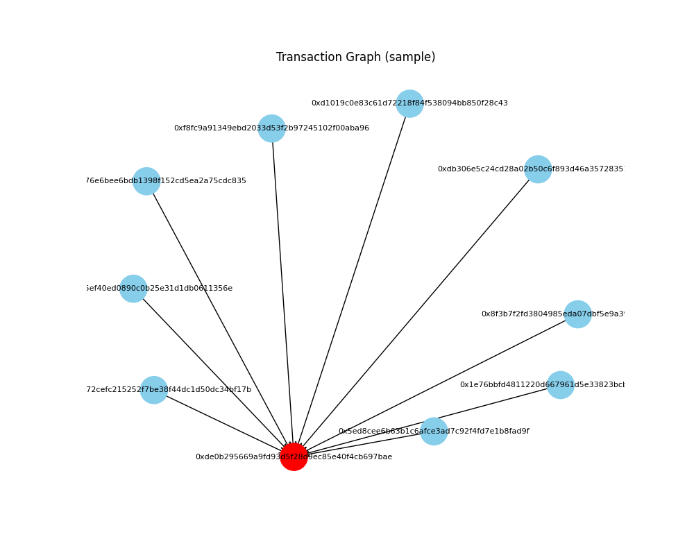

# HTXDFSIntern

This project fetches historical cryptocurrency data using the Etherscan API

## Features
Fetch recent transactions of any Ethereum wallet
- Builds a directed graph of wallet interactions
- Visualize with NetworkX + Matplotlib
- Simple insights into wallet activity

## Installation 
1. Clone the repo either with GitHub desktop or 
   git clone https://github.com/xXerii/HTXDFSIntern.git

   cd HTXDFSIntern 
   python -m venv venv 
   source venv/bin/activate # Mac/Linux 
   venv\Scripts\activate # Windows 

2. Intalling dependencies:
   pip install -r requirements.txt

## Usage
python src/crypto_graph.py

This will show a graph with regards to recent transactions for the wallet address

Example: 

Disclaimer:

Apologies as I only managed to finished task 1.
